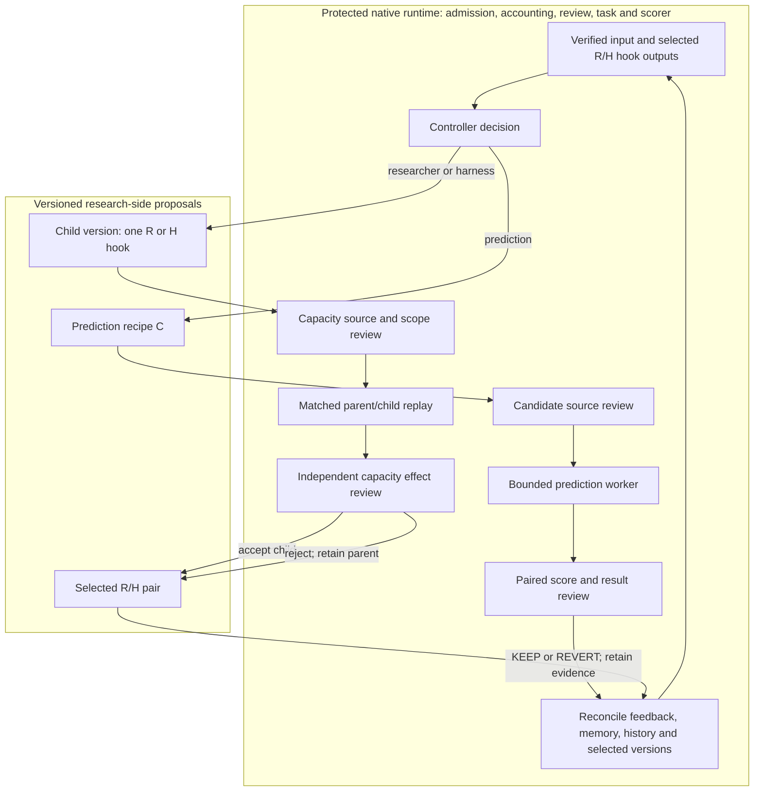

# Architecture

## Goal and published boundary

Market RSI studies whether an automated researcher can improve its predictions
and its research process through verified experimental feedback. The system
tracks three change types separately: a prediction recipe (**C**), a researcher
policy (**R**), and a research-side harness/tool policy (**H**). Co-evolution means
that reviewed R/H versions can influence later scientific decisions, alongside
the ordinary candidate-development loop.

This page describes published `main` at `03d31a0` (October 8, 2026 UTC). Its
native price entry supports the `price_discovery_launch_v1` and `v2` schemas,
both bounded to **two rounds**. Version 2 adds the R/H capacity route. Newer
Supervisor checkpoints remain a separate local development history; this map
does not describe their prospective longer-loop or resume changes.

The implemented price task is an opened-Train, historical NFL **300-second
trade-VWAP-change diagnostic**. It compares predictions on the same rows with
saved baselines. Trade prices are not executable quotes; the diagnostic does
not establish profitability. Equities/earnings is a proposed next task, not an
implemented entry profile in this snapshot.

## One round, five logical roles

The **Controller** receives reviewed feedback, memory, history, a candidate pool,
and source context, then chooses the next scientific action. The **Author**
implements that decision as a versioned prediction recipe or R/H source/test
pair. The **Worker** runs the admitted experiment or matched capacity replay.
The **Independent Reviewer** reviews input, source and results. The trusted
**Supervisor runtime** coordinates stages, checks bindings and limits, and
records the result for the next input.

These are logical responsibilities rather than a fixed number of models or
machines. Account calls return structured text; trusted adapters decide what
can be written or executed. Model responses do not become arbitrary host
commands. Actual model and runtime identities belong in each run's bindings.

Every round follows the same seven durable stages:

```text
input → controller → implement → source_review → execute → result_review → reconcile
```

`reconcile` produces a new five-part bundle: `feedback`, `memory`, `history`,
`pool`, and `source_context`. The next `input` consumes that exact bundle and
its hashes. Process failures and resource/timing observations travel with the
history; scientific findings and candidate/capacity decisions travel with the
feedback. This makes delivery inspectable; better decisions still require
experimental evidence.

## Two development loops inside one protected runtime



**Prediction route (C).** A candidate names its actual research parent and the
comparison incumbent. The author creates source-bound material; review admits
the fixed worker operation. Results compare the candidate, parent, incumbent
and ordinary reference on identical rows. `KEEP` updates the prediction
incumbent; `REVERT` retains it. Failed or unscored candidate attempts can return
`UNCHANGED`, also retaining the incumbent. The archive preserves failed candidates
and reviewed findings. A separate research-credit route can retain useful branches
for further exploration without declaring them the best predictor.

**Capacity route (R/H).** The Controller selects one researcher or harness
component, triggering evidence and a named expected effect. The author writes
a fresh versioned source/test pair. The reviewed child is tested alongside
the selected parent on frozen success, failure, restart and historical-replay
contexts, plus the current downstream context. An independent effect review
accepts or rejects it. Acceptance changes the selected R/H pair while idle;
rejection leaves the parent selected. Both outcomes return findings and the
selected identity to the next round, which invokes the selected hooks.

The current extensible interface is a restricted, pure `apply(context)` hook
that returns research advice/tool output. **H here is a research-side policy,
not permission to rewrite the native runtime.** The proposal cannot change
the candidate pool, protected data, scorer or authority. Capacity identity
checks keep kernel **K**, base model **M**, predictor **C**, runtime and memory
commitment fixed during an R/H comparison. Static source admission is a
restricted-language check, not OS containment. The activation registry also
supports an evidence-bound rollback to a previous accepted pair.

Matched supplied-context replay establishes a narrow behavioral effect, not
general research ability or prediction gain. Source existence, passing tests,
completed delivery, accepted capacity changes and sustained self-improvement
are distinct evidence claims.

## Code map

Paths below are relative to the repository root. This is the full current code
map; module READMEs describe only their own interfaces.

| Responsibility | Source entry points |
| --- | --- |
| Developer CLI and regression selection | [`market_rsi/cli.py`](../market_rsi/cli.py), [`checks.py`](../market_rsi/checks.py), [`configs/checks.json`](../configs/checks.json) |
| Native launch, preflight and reviewed recovery | [`supervisor_harness/run_price_discovery.py`](../research/market_rsi/supervisor_harness/run_price_discovery.py) |
| Durable stages and existing ledger admission | [`feedback_linked_loop.py`](../research/market_rsi/supervisor_harness/feedback_linked_loop.py), [`feedback_loop_runtime.py`](../research/market_rsi/supervisor_harness/feedback_loop_runtime.py), [`coevo_pilot_transaction.py`](../research/market_rsi/supervisor_harness/coevo_pilot_transaction.py) |
| Feedback packet, branch pool and reconciliation | [`price_loop_services.py`](../research/market_rsi/supervisor_harness/price_loop_services.py), [`price_loop_handoff.py`](../research/market_rsi/supervisor_harness/price_loop_handoff.py) |
| Account-backed Controller/Author/review transport | [`price_account_roles.py`](../research/market_rsi/supervisor_harness/price_account_roles.py), [`account_controller_feedback_consumer.py`](../research/market_rsi/supervisor_harness/account_controller_feedback_consumer.py) |
| Candidate implementation and independent review | [`price_candidate_author.py`](../research/market_rsi/supervisor_harness/price_candidate_author.py), [`price_independent_review.py`](../research/market_rsi/supervisor_harness/price_independent_review.py) |
| R/H branching, child authorship and hook delivery | [`price_capacity_loop.py`](../research/market_rsi/supervisor_harness/price_capacity_loop.py), [`price_capacity_services.py`](../research/market_rsi/supervisor_harness/price_capacity_services.py) |
| R/H source checks and measured replay | [`price_capacity_source.py`](../research/market_rsi/supervisor_harness/price_capacity_source.py), [`price_capacity_trial.py`](../research/market_rsi/supervisor_harness/price_capacity_trial.py), [`price_capacity_replay.py`](../research/market_rsi/supervisor_harness/price_capacity_replay.py) |
| Identity, small-step journal and idle activation | [`research_capacity_identity.py`](../research/market_rsi/supervisor_harness/research_capacity_identity.py), [`research_capacity_activation.py`](../research/market_rsi/supervisor_harness/research_capacity_activation.py), [`co_evolution_loop.py`](../research/market_rsi/data_scientist_harness/co_evolution_loop.py) |
| Native scheduling, execution and attempt history | [`continuous_discovery_batch.py`](../research/market_rsi/supervisor_harness/continuous_discovery_batch.py), [`opened_train_discovery_worker.py`](../research/market_rsi/supervisor_harness/opened_train_discovery_worker.py) |
| Historical price rows, fixed task and scoring | [`nfl_ingame_price_data.py`](../research/market_rsi/experiments/nfl_ingame_price_data.py), [`nfl_ingame_price_change_train_diagnostic.py`](../research/market_rsi/experiments/nfl_ingame_price_change_train_diagnostic.py), [`nfl_ingame_price_score.py`](../research/market_rsi/experiments/nfl_ingame_price_score.py) |

## Directory ownership

```text
market_rsi/                         Thin developer CLI; forwards legacy helper APIs
configs/                            Named developer-check suites
benchmarks/nfl_price/                Task/source reading index, not another runner
tests/                              Developer interface/layout regression tests
tools/                              Developer compatibility entry
docs/                               Project architecture, development and history
research/market_rsi/                 Source-bound native implementation
  supervisor_harness/               Loop services, roles, workers, review and state
  experiments/                      Task definitions, diagnostics and candidates
  data_scientist_harness/            Co-evolution controls and earlier research tools
  ds_harness_core/                   Domain-neutral feature/quality validators
  quote_source/                     Separate causal source-quote reconstruction
  pmb_simple_lane/                   Separate immutable episode/specification lane
  minimal_prediction_loop/           Earlier probability protocol/scoring components
```

The root `market_rsi/` package delegates price execution to the native module
from its original working directory. Core implementation remains under
`research/market_rsi/`; many native `test_*.py` files remain beside their modules.
The directory split reflects source-binding and compatibility constraints, not
a completed migration into the root package. Earlier/adjacent lanes are not
additional stages of the current price entry.

Runtime configuration, authority, ledgers and immutable outputs use the
configured local artifact store. Some historical records remain tracked in
this published snapshot; their presence does not make them current execution
instructions. Local working logs and new run evidence belong outside the
public source inventory.

For environment setup and exact checks, see [Development](DEVELOPMENT.md).
For earlier designs and operational records, see [History](HISTORY.md).
