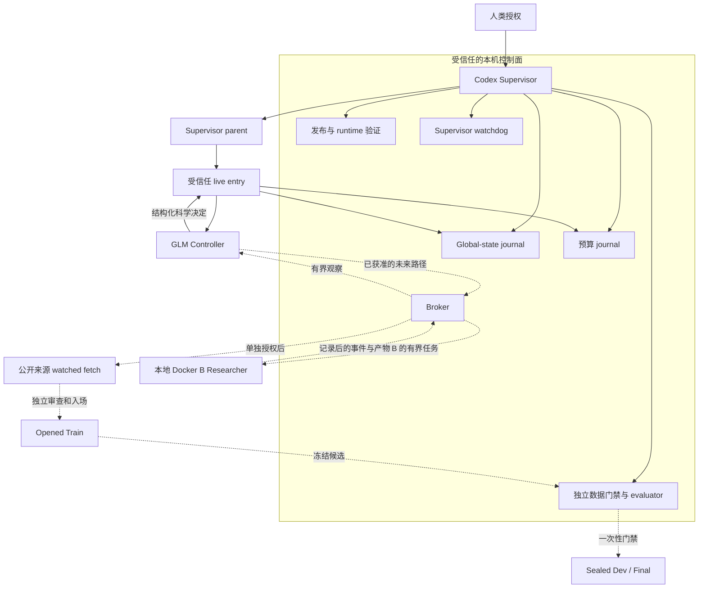

# Market RSI 系统架构

本文是当前架构的入口文档。它说明系统现在实际运行什么、各层由谁负责、一次研究周期怎样流转，以及哪些能力仍然只是未来目标。

状态快照：2026-09-28，公开协议版本 `market-rsi-protocol-v0.1.24`。

## 一句话概括

Market RSI 不是一个可以直接自由操作数据和训练模型的 LLM。它是一套分层、失败即关闭的研究系统：外层 Supervisor 管版本、授权、预算、状态和证据；GLM Controller 只做受约束的科学决策；Researcher 只能在获准的隔离环境中执行任务；数据入场、训练和封存评估各有独立门禁。

当前真正跑通的是发布验证、零 provider canary、一次受监督的 GLM Controller D0 调用，以及失败后的预算和状态闭环。历史 2025 opened-Train 数据存在，但当前 P0 Gate 1 所需的新 real Train catalog 尚未正式入场，预测自循环实验尚未开始。

## 四个架构层

| 层 | 主要责任 | 当前实现 | 明确不能做 |
| --- | --- | --- | --- |
| 控制面 | 人类授权、版本、global state、预算、watchdog、证据与清理 | Codex Supervisor、`global_state_gate.py`、`paid_budget.py`、Supervisor parent/watchdog | 不替 Controller 选择科学路线；不修改模型回答；不越过数据门禁 |
| 决策面 | 选择下一项科学问题、来源、用途、时间边界和调查范围 | GLM/Tinker 单样本 Controller adapter | 不直接访问本机文件、密钥、Train/Dev/Final；不执行 fetch、训练或任意代码 |
| 执行面 | 执行 Controller 已获准的有界研究任务 | 本地 Docker B 的合成传输与隔离 canary 已通过；真实任意研究任务尚未准入 | B 不能读取 A/Controller 状态、Supervisor 文件、密钥或封存评估器 |
| 数据与评估面 | 来源核验、数据入场、Train 研究、Dev/Final 封存评分 | 来源 screen、候选入场代码、Data Scientist Harness、sealed gate | Controller 不能自行签发入场；Train 诊断不能冒充 OOS 结果；Final 不能反复打开 |

这里的 A 指 GLM Controller，B 指隔离的 Researcher。A 可以经 broker 给 B 下达有界任务并读取经过记录的结果；B 不能直接调用、读取或修改 A。

## 信任边界



实线表示当前 D0 Controller 路径已经实际运行。虚线表示代码可能存在，但仍需要独立授权、当前版本 canary 和对应门禁；它们不是由一次 D0 回答自动开启的。

## 当前一次 D0 调用怎样运行

生产入口只有：

`supervisor_harness/p0_gate1_controller_supervisor_parent.py`

它启动受信任 child，但不会直接调用 Controller adapter。完整顺序如下：

```text
人类明确授权
  -> Supervisor parent 验证发布、packet 和 prior canary
  -> 创建 Supervisor root，并启动唯一 child
  -> live entry 做无凭据 preflight
       - 发布 commit/tag/source digest
       - runtime receipt
       - packet 文件与 canonical hash
       - global-state head 与 decision document
       - 预算和未使用 ID
       - 同 ID 进程/容器不存在
  -> 读取本地凭据，构造 GLM backend
  -> outer transaction
       - claim global-state cycle
       - 预留最多 $0.05
       - 标记一次 dispatch
       - adapter 编码并调用最多一个 sample
       - 保存 raw response 和 provider receipt
       - 本地解析、语义校验和独立 outer review
       - 以 metered 或 uncertain terminal 状态结算预算
       - 关闭 global-state cycle 为 passed 或 failed
  -> watchdog 核对 child、预算、进程和容器
  -> 保存 terminal result；失败时生成 incident 和 repair input
```

这条路径有三个重要性质：

1. `reserve` 不是消费。只有 provider 返回的 terminal usage 或保守 uncertain upper bound 才进入有效成本。
2. 一旦 dispatch，该 ID 永久不能重试，即使回答格式或语义无效。
3. Controller 的有效决定也只是“决定”；它不会自动 fetch、准入数据或训练。

## 状态机

### Global state

```text
idle
  -> decision_revision       # 只允许 idle 时更新受控决策文档
  -> cycle_claim             # 固定 ID、source、canary 和 decision hash
  -> cycle_close(passed|failed)
  -> idle
```

约束：同时最多一个 active cycle；ID 永不复用；文档字节变化但没有 journal revision 时，入口 fail closed；失败关闭时不会伪造成功 review。

实现：`supervisor_harness/global_state_gate.py`。

### 预算

```text
authorized
  -> reserved                # 占用上限，不是费用
  -> dispatched              # 已经可能产生外部费用，不能当作未发送取消
  -> metered_terminal        # 有 terminal token/usage receipt
     或 uncertain_terminal   # 本地已终止，但远端用量未知，按上限保守记账
  -> invoice                 # 可选；到账单后替代估算
```

实现：`paid_budget.py`。全局硬上限和 bucket 配额同时生效；旧 job、未结算 dispatch 或不足余额都会阻止新运行。

## Controller 的输出边界

D0 工具只允许 Controller 提交五个科学对象：

1. 来源与 response class；
2. 预期用途；
3. 未来数据角色与 split policy；
4. horizon 与 cutoff 语义；
5. 有界调查模式与建议上限。

`p0_gate1_controller_adapter.py` 负责构造模型可见 prompt/tool schema、调用一个 sample 并解析提交；`prospective_source_scope_decision.py` 是权威的本地语义 validator。可信代码可以补充固定安全字段和 decision ID，但不能替 Controller 选择或修正科学对象。

有效 D0 仍然是非执行决定。它不能表示以下动作已经发生：

- 来源已访问或权利已确认；
- 请求 manifest 已授权；
- 数据已下载、保留或正式入场；
- Train、Dev 或 Final 已打开；
- 模型已训练或预测性能提高。

## 从 D0 到预测实验

后续阶段必须逐级通过，不能跳跃：

| 阶段 | 输入 | 输出 | 必要门禁 |
| --- | --- | --- | --- |
| 1. D0 source/scope decision | 冻结 packet | 非执行科学决定 | 单样本、预算、语义 review |
| 2. Exact request plan | 有效决定和已审 catalog | 固定 URL/参数/上限/停止条件 | 可信 compiler；不允许模型任意拼请求 |
| 3. Watched fetch | 单独 fetch 授权 | 原始响应和网络/进程证据 | watchdog、字节/时间/请求上限、来源 allowlist |
| 4. Candidate admission | 固定来源产物 | 候选快照和待审 Train receipt | rights、coverage、exposure、hash、完整分母；独立签发后才可正式入场 |
| 5. Train-only research | 已入场 Train | 特征、trainer、预测和诊断 | 同样样本/目标；一次只改一个因果层 |
| 6. Sealed evaluation | 冻结候选 | Dev/Final 评分 | 先承诺后读取；一次性 allowance；至少 20 个 untouched sessions 才能正式推广 |

“代码存在”不等于该阶段已获准。特别是 `p0_gate1_public_fetch.py`、`p0_gate1_watched_fetch.py`、`p0_candidate_admission_integration.py` 和 `formal_train_admission.py` 的存在，不会自动赋予 fetch 或数据入场权限。

## Researcher B 和 Data Scientist Harness

本地 Docker B 是未来的研究执行面。当前已验证的是合成任务的 A -> broker -> B -> broker -> A 传输、消息哈希和精确清理；尚未验证一个真实 GLM 决策驱动任意研究代码并产生预测改进。

`data_scientist_harness/` 是 B 可在获准条件下使用的数据科学能力集合，而不是另一个决策模型。它包括：

- 来源和时间语义检查；
- 原始序列、特征和缺失检查；
- 有界 CPU trainer；
- 运行前假设和运行后结果轨迹；
- opened-Train 诊断；
- sealed Dev handoff。

Supervisor 负责安全、版本和证据；Controller 负责研究选择；Researcher 负责执行；Evaluator 负责独立测量。任何一层都不能同时替代其他三层。

## 代码地图

| 入口或模块 | 用途 |
| --- | --- |
| `supervisor_harness/p0_gate1_controller_supervisor_parent.py` | 当前 D0 的唯一生产父入口；启动、监控和清理 child |
| `supervisor_harness/p0_gate1_controller_live_entry.py` | 无凭据 preflight、凭据加载和唯一 backend 绑定 |
| `supervisor_harness/p0_gate1_controller_outer.py` | global-state、预算、adapter、review 的原子式外层事务 |
| `supervisor_harness/p0_gate1_controller_adapter.py` | 单样本 GLM 请求、工具接口、原始回复和 provider receipt |
| `supervisor_harness/prospective_source_scope_decision.py` | D0 决定的权威语义 schema/validator |
| `supervisor_harness/global_state_gate.py` | 决策文档绑定、cycle claim/close、ID 去重 |
| `paid_budget.py` | 授权、预留、dispatch、metering、uncertain 和 invoice 账本 |
| `supervisor_harness/supervisor_watchdog.py` | 运行进度、进程/容器身份、incident 和终态清理 |
| `supervisor_harness/protocol_source_release.py` | 发布 tag、commit 和 controlled source manifest 验证 |
| `supervisor_harness/gate1_canary_receipt.py` | prior canary 的完整性与当前源码/runtime 绑定 |
| `supervisor_harness/p0_gate1_plan_compiler.py` | 把已审决定编译为精确请求计划 |
| `supervisor_harness/p0_gate1_watched_fetch.py` | 把获准 fetch 绑定到 watchdog |
| `supervisor_harness/p0_candidate_admission_integration.py` | 组合并核验候选数据快照，不等于正式入场 |
| `supervisor_harness/formal_train_admission.py` | 校验独立签发的 Train admission receipt |
| `supervisor_harness/local_b_container.py` | 本地 Docker B 的受限文件和生命周期边界 |
| `data_scientist_harness/` | 数据科学检查、Train-only 研究和 sealed handoff 工具 |

## 持久化布局

重要运行证据不放 iCloud 或临时目录：

```text
/Users/estelle/Developer/market-rsi
  公开代码、Git history、release tag

/Users/estelle/Library/Application Support/MarketRSI
  control/                 当前受保护 decision document
  runs/                    每个 canary/paid run 的不可复用根目录
  runtimes/                固定 Python runtime
  budget-authoritative-*/  唯一权威预算账本
  self-evolving-*/         global-state、claim 和历史本地证据
```

运行目录按 ID 创建且不得覆盖。原始 response、receipt、review、failure、incident 和 cleanup 都保留；失败不能被后来的成功覆盖。

## 当前状态

截至 2026-09-28：

- v0.1.24 已发布并通过完整测试、独立发布验证和零 provider production-CLI canary。
- D0 `market-rsi-v0124-gate1-controller-d0-20260928-01` 调用一次 GLM/Tinker 后终态失败。
- 失败发生在本地语义校验：模型选择 `bounded_response_canary_proposal`，同时提交 `max_documents_proposed=1`；validator 要求 canary proposal 为 `0`。
- 根因是 mode-dependent 规则没有暴露在模型可见 tool schema，而不是网络、provider、预算或 watchdog 故障。
- 计量费用为 `$0.02746872`，无自动重试、无 public fetch、无 sealed-data read、无数据入场、无训练。
- 当前没有有效 Gate 1 数据调查计划，也没有预测改进结果。

下一项最小修复应只提高 tool schema 的规则可见性，保持本地 validator 和其他生产层不变。修复后需要新版本、完整测试、独立 review、新 zero-provider canary；任何新付费运行还需要全新 ID 和授权。

## 变更规则

对任何会影响生产路径的修改：

1. 先写明观察到的问题和唯一要修改的因果层；
2. 添加能够重现失败的测试，并验证原始失败证据仍被拒绝；
3. 不在 trusted code 中静默修正 Controller 的科学选择；
4. 跑 focused tests 和完整测试；
5. 由非作者独立审查 diff、边界和结果；
6. 使用新 commit、annotated tag、source digest 和 runtime receipt；
7. 源码或 runtime 改变后，旧 canary 失效；
8. 新 paid/fetch/data/evaluation 动作分别重新授权。

## 阅读顺序

1. 本文：当前系统全景。
2. `supervisor_harness/RESEARCH_STATE.md`：当前科研决定，不是历史日志。
3. `supervisor_harness/RESEARCH_SUPERVISOR.md`：Supervisor 操作协议。
4. `supervisor_harness/P0_FIVE_SEASON_DATA.md`：当前数据瓶颈和准入目标。
5. `data_scientist_harness/README.md`：Train-only 研究工具和边界。
6. `HARNESS_VERSIONS.md`：版本、归因和 canary 规则。

带日期的 contract、incident、agent log 和旧 canary 文档用于追溯历史。若它们与本文或当前 `RESEARCH_STATE.md` 冲突，以当前受保护 state、已发布源码和实际 journal/receipt 为准。
