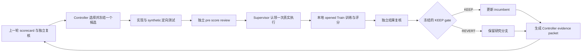

# Market RSI 连续自主 Discovery 第一批详细实验报告

报告日期：2026 年 9 月 29 日  
研究主线：`SettlementProbabilityTrainDiagnostic-v0`  
批次状态：完成，停止原因为 `deadline_reached`  
证据范围：已驻留本地并已打开的 2025 NFL moneyline Train

## 报告摘要

这一批工作的目标不是完成正式论文 benchmark，也不是证明模型已经可以 promotion，而是验证两件更基础但关键的事情：第一，能否在真实 Train 数据上连续跑出候选模型、分数和可复核结论；第二，Controller 能否读取上一轮证据，自主改变下一轮研究选择，而不需要用户逐轮指定实验。

批次从 `2026-09-29T18:03:21Z` 开始，在 `2026-09-29T20:03:21Z` 的两小时硬截止结束。最多允许 10 次真实候选尝试，实际认领并完成 5 次。五次执行均成功产生完整 artifact，并分别经过独立结果复核；其中 1 次 `KEEP`、4 次 `REVERT`。没有失败执行，没有自动重试，也没有在分数不理想时提前停止。

本批次的当前最佳预测是第三轮产生的 `MarketRecencyWeightedCompositePath-v3`。在 87 场重复使用的 Train chronological checks 上，它的 equal-event Brier 为 `0.2038565961`，log loss 为 `0.5958367713`；同期 decision-time market 为 `0.2055333637 / 0.5984509292`。因此 v3 相对市场的差值为：

- Brier：`-0.0016767676`
- log loss：`-0.0026141579`
- Brier 胜过市场的 folds：`3/4`

第五轮 `MarketRecencyWeightedCompositeDispersion-v5` 得到了本批次最低的 aggregate loss：Brier `0.2022600315`、log loss `0.5918191393`。它相对 v3 又改善 `-0.0015965647 / -0.0040176321`，并在 3/4 folds 的 Brier 上胜过 v3。但是它只在 2/4 folds 胜过原始市场，没有通过预先冻结的 market stability gate，因此结论严格为 `REVERT`，v3 继续作为 incumbent，v5 则保留为当前最有希望的研究分支。

这个处理很重要：`KEEP/REVERT` 只决定是否替换当前最佳模型，不决定一条研究分支是否有价值。v5 的 aggregate 改善不能覆盖它未通过的折间稳定性门槛；同样，`REVERT` 也不意味着 dispersion 没有信息。

## 研究目标和授权边界

本批次执行的是开放式 Train Discovery。Controller 可以改变特征、表示、模型、训练方法和研究流程，也可以组合修改；Supervisor 固定和管理的是数据权限、时间因果、评分口径、运行预算和 protected evaluation 边界。

本批次明确允许：

- 读取已经驻留、已经打开的完整 Train；
- 在 Train 内进行 chronological rolling validation；
- 修改候选代码、特征工程、模型和训练方法；
- 反复查看 Train checks 并积累研究记忆；
- 保存失败候选及其经验，继续发展有价值的分支。

本批次明确禁止：

- 读取 protected Dev 或 Final；
- 外部抓取、联网取数或购买数据；
- 调用付费 provider；
- 发布新版本、deployment 或 promotion；
- 把重复查看的 Train checks 称为 untouched OOS；
- 把 NFL seed domain 的结果外推为 Market RSI 的永久范围；
- 把单批候选改进归因于 RSI self-evolution。

最终持久状态中的所有权限位均保持关闭：`network_allowed=false`、`paid_provider_allowed=false`、`protected_dev_final_allowed=false`、`publication_allowed=false`、`promotion_allowed=false`。唯一为真的数据范围标记是 `resident_opened_train_only=true`。

## 连续研究闭环架构

Supervisor 没有把 Controller、执行器和评估器混成一个会自行扩权的进程。连续状态组件只记录和验证研究生命周期；它不执行 runner、不读数据、不评分，也不能打开网络、provider、Dev/Final、发布或 promotion 权限。



机器状态的固定顺序是：

```text
controller_selected
-> implementation_ready
-> execution_claimed
-> execution_terminal
-> result_reviewed
-> controller_feedback_ready
```

只有到 `execution_claimed` 才消耗一次尝试。真实 runner 即使失败，也会占用尝试次数；规划、代码实现、synthetic 测试和只读复核不计入尝试。重复提交同一 claim ID 是幂等操作，不会重复计数；用不同 ID 重复认领会 fail closed。

只有满足以下三个条件时，候选才能替换 incumbent：真实执行成功、结果决定为 `KEEP`、`independently_reviewed=true`。`REVERT`、失败执行或未独立复核的结果都不会修改 incumbent，但对应 branch 会继续留在历史中。

批次结束时，持久 journal 有 32 条记录：

- journal head：`bb254c289f7ba5ce739b2a86e26b401747271cc4eb5d10b86302f1c95095d465`
- state SHA-256：`300a744fe4060edda8fed533c73ba6ddd65adb753fd0b5759790a3fb270d7f88`
- active attempt：无
- attempts claimed：5
- failed attempts：0
- stop reason：`deadline_reached`

## 数据和评估合同

### 完整研究分母

研究 cohort 是按结果无关的数据就绪标准选择的 2025 NFL two-outcome moneyline Train。NFL 在这里是当前最可运行的 seed domain，不是永久研究范围。

| 项目 | 冻结值 |
| --- | ---: |
| Source events | 195 |
| Source schedule dates | 42 |
| Materialized binary events | 194 |
| Reported exclusions | 1 |
| Chronological check events | 87 |
| Check schedule dates | 20 |
| Observed check game weeks | 7 |

唯一排除事件是 `2025_04_GB_DAL`。其 outcomePrices 不是精确的 `[0,1]` 或 `[1,0]`，因此以 `unresolved_outcome` 明确报告，没有静默删除。完整分母始终按 `195 = 194 + 1` 对账。

### 时间和方向

- 预测目标：主队最终获胜的 settlement probability。
- outcome/token orientation：每场按 source receipt 绑定 home team 与 home token ID。
- 决策时间：`event_start_utc - 15 minutes`。
- 决策时市场概率：不晚于 cutoff 的最新合格整数秒上，按成交 size 加权的 home-win probability。
- 最大成交 staleness：inclusive `600` 秒。
- 本 cohort 实际观察到的最大合格 staleness：`313` 秒。
- outcome 可用时间：已存在字段中 `event.finishedTimestamp`、`market.closedTime` 和 `market.umaEndDate` 的最大值；没有引入其他时间源。

### Chronological checks

初始 fit 使用最早 22 个赛程日。之后执行四个 expanding checks，每个 check 包含接下来的 5 个完整赛程日；后续 fold 可以使用此前已经结算的 check 日期作为 fit 数据，但不能使用当前或未来 check 的标签。

四个 check 的事件数分别是：

| Fold | Check events | Check dates |
| ---: | ---: | --- |
| 1 | 26 | 2025-10-23 至 2025-11-02 的 5 个赛程日 |
| 2 | 16 | 2025-11-03 至 2025-11-13 的 5 个赛程日 |
| 3 | 28 | 2025-11-16 至 2025-11-24 的 5 个赛程日 |
| 4 | 17 | 2025-11-27 至 2025-12-04 的 5 个赛程日 |

所有 baseline 和 candidate 都使用完全相同的 87-event mask。后续候选没有通过删除 stale、难预测或端点事件来改善分数。

### 评分和不确定性

主指标是 equal-event Brier，越低越好。辅助指标包括 equal-event log loss、calibration slope/intercept、完整 population coverage、事件/日期/周 breadth、逐折 paired delta，以及按完整赛程日和 observed game week 进行的 grouped resampling。

分组重采样不是先计算每日指标再等权平均。每个 bootstrap draw 先抽取完整日期或周，再在抽中的所有比赛上重新计算 pooled equal-event loss delta，因此与主 estimand 保持一致。seed 固定为 `23`，每种 grouped inference 使用 1,000 次重采样。

这些区间是 Discovery 描述和稳定性诊断，不是 formal OOS 置信声明。尤其是第 14 周只有 1 场，是一个右边界部分周，因此 week-level 结果只能视为敏感性分析。

## 进入连续批次前的基准

在连续批次开始前，第一张真实 settlement scorecard、full offset 和 market-only calibration 已经确定了研究起点。

| 模型或基准 | Brier | Log loss | 相对市场 Brier | 结论 |
| --- | ---: | ---: | ---: | --- |
| Decision-time market | 0.205533 | 0.598451 | 0.000000 | 批次起始 incumbent |
| Ordinary LogisticRegression | 0.235605 | 0.675948 | +0.030071 | ordinary reference |
| Fixed HGB | 0.269768 | 0.779223 | +0.064235 | REVERT |
| Market-only ridge calibration | 0.205852 | 0.599385 | +0.000318 | REVERT |
| Full 17-feature market offset | 0.209451 | 0.608268 | +0.003917 | REVERT |

这里的 LogisticRegression 只称 ordinary reference。没有在 Train-only baseline selection 中胜出，因此没有把它写成 `Strong-Baseline-1`。

market-only calibration 没有带来 aggregate 改善，而 full offset 在相同 ridge 语义下进一步变差。full offset 相对 market 的日分组 Brier 区间为 `[+0.000845, +0.007130]`，在当前 Discovery 样本上提供了较一致的损害证据。这一结果支持“先减少冗余和 nuisance directions”，但不能推出所有非市场特征都无效。

## 五次连续候选实验

| 尝试 | 候选 | Brier | Log loss | 候选减市场 Brier | 候选减市场 Log loss | 市场 Brier fold wins | 决定 |
| ---: | --- | ---: | ---: | ---: | ---: | ---: | --- |
| 1 | `MarketOrthogonalPricePath-v1` | 0.206923 | 0.602529 | +0.001390 | +0.004078 | 1/4 | REVERT |
| 2 | `MarketRecentCompositePath-v2` | 0.204238 | 0.596373 | -0.001295 | -0.002078 | 2/4 | REVERT |
| 3 | `MarketRecencyWeightedCompositePath-v3` | 0.203857 | 0.595837 | -0.001677 | -0.002614 | 3/4 | KEEP |
| 4 | `MarketAllPriorDecayCompositePath-v4` | 0.204422 | 0.597080 | -0.001111 | -0.001371 | 3/4 | REVERT |
| 5 | `MarketRecencyWeightedCompositeDispersion-v5` | 0.202260 | 0.591819 | -0.003273 | -0.006632 | 2/4 | REVERT |

### 尝试一 压缩和正交化价格路径

`MarketOrthogonalPricePath-v1` 是对 full offset 失败的直接响应。Controller 没有继续向 17 个 residual 特征增加复杂度，而是把已有的因果价格历史压缩为两个有方向的 family：当前价格相对 15、60、240 分钟 VWAP 的位置，以及三个窗口 last-minus-first 变化的均值。每一折只在过去 fit 数据上相对 market logit 做 residualization。

结果比 full offset 明显好：Brier 改善 `-0.002527`，log loss 改善 `-0.005738`。但它仍比市场差 `+0.001390 / +0.004078`，仅在 1/4 folds 的 Brier 上胜过市场，因此 `REVERT`。

这一轮的价值不是找到 incumbent，而是定位出两个问题：压缩确实减少了 full offset 的损害；同时，fit 期和 check 期的 signed association 不稳定，说明对整个历史使用同一关系可能有 regime mismatch。

### 尝试二 最近三周 composite

`MarketRecentCompositePath-v2` 根据尝试一的符号不稳定，把 candidate fit support 限制到每折 check 之前最近三个完整 game weeks，并把两个 path family 压缩为一个 composite。没有做 window sweep，也没有根据结果挑不同 penalty。

它第一次在 aggregate 上胜过市场：Brier `-0.001295`、log loss `-0.002078`。但市场 Brier fold wins 只有 2/4，未达到 3/4 的稳定性门槛，因此仍为 `REVERT`。

证据改变了下一轮问题：aggregate 方向已经转正，主要缺口不再是“是否完全没有信号”，而是最近三周被等权对待是否给较旧 regime 过多权重。

### 尝试三 固定 recency 权重

`MarketRecencyWeightedCompositePath-v3` 保留尝试二的最近三周 cohort、表示和单参数 market-offset 模型，只把三周事件权重固定为 `.25 / .50 / 1.00`，从最旧周到最新周逐步增加。这个改动测试的是 recency weighting，而不是重新搜索窗口、特征和模型。

v3 的 aggregate Brier/log loss 为 `0.2038565961 / 0.5958367713`，相对市场改善 `-0.0016767676 / -0.0026141579`，并在第 2、3、4 folds 胜过市场。所有 market、ordinary 和 fold gates 均通过，因此独立复核后 `KEEP`，成为新的 Discovery incumbent。

相对尝试二，v3 进一步改善 Brier `-0.0003814626`、log loss `-0.0005359774`。改善幅度不大，但它把市场 fold wins 从 2/4 提高到 3/4，正好解决了上一轮的主要缺口。

### 尝试四 全历史指数衰减消融

尝试三成功后，Controller 没有直接假定“只看三周一定正确”，而是测试一个反事实：是否可以使用所有严格过去的 weeks，再用一周半衰期的指数权重降低方差。

`MarketAllPriorDecayCompositePath-v4` 仍胜过市场，并有 3/4 market fold wins，但它比 v3 的 Brier 差 `+0.0005657679`、log loss 差 `+0.0012435350`，也没有满足替换 v3 所需的 incumbent gates，因此 `REVERT`。

这次负结果说明，在当前样本和固定 recipe 下，额外的旧历史带来的 regime bias 大于其方差降低收益。它不证明全历史方法永久无效，但足以支持下一轮回到 v3 的最近三周结构，而不是继续扫 half-life。

### 尝试五 正交 dispersion 增量信息

`MarketRecencyWeightedCompositeDispersion-v5` 完整保留 v3 的最近三周 cohort、path composite、`.25 / .50 / 1.00` 权重和 scorer，只增加一个新的信息 family：15、60、240 分钟 weighted probability standard deviation 的均值。

这个 dispersion raw feature 先在当前 fold 的 selected fit rows 上，对 `[1, z_market, z_composite]` 做 OLS residualization；只有 residual variance 足够时才标准化。最终模型为：

```text
eta = market_logit + w_composite * z_composite + w_dispersion * z_dispersion
```

训练目标是 weighted mean Bernoulli NLL 加 `0.5 * (w_composite^2 + w_dispersion^2)`，每折从两个零系数开始用固定 L-BFGS-B 设置优化。所有 archived controls 只读复用，没有 refit。

v5 取得本批次最低 aggregate loss，并且胜过 v3 的 aggregate Brier/log loss及 3/4 paired folds。然而，它相对市场的四折 Brier delta 是：

| Fold | Events | Market Brier | v3 Brier | v5 Brier | v5 减市场 | `w_composite` | `w_dispersion` |
| ---: | ---: | ---: | ---: | ---: | ---: | ---: | ---: |
| 1 | 26 | 0.212095 | 0.216585 | 0.216515 | +0.004420 | -0.123109 | -0.011533 |
| 2 | 16 | 0.203744 | 0.201046 | 0.204721 | +0.000977 | +0.068560 | -0.116427 |
| 3 | 28 | 0.175080 | 0.171357 | 0.167017 | -0.008062 | +0.058481 | +0.062919 |
| 4 | 17 | 0.247341 | 0.240565 | 0.236189 | -0.011152 | +0.138291 | +0.115323 |

v5 的 aggregate 改善主要来自第 3 和第 4 folds，在前两个 folds 仍输给市场。`w_dispersion` 也从前两折负值变为后两折正值。这种符号和收益结构说明 dispersion 很可能包含某种 regime-dependent 信息，但当前 trainer 还没有稳定地使用它。

因此冻结的规则给出 `REVERT`：v5 虽然通过了 ordinary、aggregate 和 incumbent gates，但只在 2/4 folds 胜过市场，没有满足至少 3/4 的 market fold gate。独立复核重算了全部分数和决定，确认这不是实现或记账错误。

## 当前最佳和最有希望分支的统计解释

### Aggregate calibration

| Arm | Mean probability | Outcome rate | Calibration intercept | Calibration slope |
| --- | ---: | ---: | ---: | ---: |
| Market | 0.549431 | 0.528736 | -0.029218 | 1.015513 |
| v3 incumbent | 0.551048 | 0.528736 | -0.022236 | 0.999862 |
| v5 branch | 0.552841 | 0.528736 | -0.031530 | 1.013430 |

这些 calibration 数字采用 scorecard 中固定的 OLS outcome-on-probability 描述。v3 的 aggregate slope 接近 1，v5 也没有表现出明显的 scale explosion；但这不能解决 v5 的折间不稳定，也不能替代 formal calibration study。

### Grouped intervals

| Comparison | Schedule-day Brier 95% interval | Observed-week Brier 95% interval |
| --- | --- | --- |
| v3 minus market | `[-0.007054, +0.005245]` | `[-0.006702, +0.005067]` |
| v5 minus market | `[-0.010357, +0.004657]` | `[-0.009400, +0.004355]` |
| v5 minus v3 | `[-0.004374, +0.001029]` | `[-0.004018, +0.000928]` |

v3 和 v5 相对市场的区间都跨过零。v5 的点估计更好，但当前 20 个 schedule dates、7 个 observed weeks 和一个只有 1 场的右边界部分周不足以支持稳定的正式 OOS 改善结论。这里的正确表述是“有方向性的 Train Discovery 证据”，不是“已经显著优于市场”。

## 上一轮证据如何改变下一轮

这批工作满足了“不是只提出下一项计划，而是把每轮推进到实际执行和解释”的要求。证据链如下：

1. Full offset 明显伤害分数，Controller 因而选择压缩和正交化，而不是继续增加变量。
2. 尝试一比 full offset 好、但 fit/check 符号不稳定，Controller 因而限制为最近三个完整 weeks。
3. 尝试二 aggregate 已胜市场、但只赢 2/4 folds，Controller 因而保留表示，只增加固定 recency weighting。
4. 尝试三通过全部 gates，成为 incumbent；Controller 随后用全历史指数衰减做反事实消融，而不是把一次 KEEP 当最终答案。
5. 尝试四比 v3 变差，Controller 停止扩展旧历史，返回 v3，并测试一个与 location/path 不同的 dispersion family。
6. 尝试五 aggregate 最好但市场 fold stability 不足，因此 incumbent 不变，同时把 dispersion 保存为下一批最值得继续的分支。

整个批次没有用户逐轮选择模型。用户只提供了批次级目标、预算和权限边界。科学选择来自已记录的 Controller decision，Supervisor 负责实现、运行、边界和故障恢复，独立 reviewer 负责 pre-score 和 result verification。

需要保留一个重要限制：各 Controller 记录没有独立查询并绑定精确 backend slug。因此，这一批可以证明“连续证据驱动研究闭环已运行”，但不能作为“同一精确 Astra 版本因积累记忆而优于从零开始”的 matched self-evolution 证据。

## 连续框架的实现和验收

为支持这一批实验，增加了最小的 `ContinuousDiscoveryBatch` 状态记录器。它的职责仅限于：

- 绑定 batch start、deadline 和 max attempts；
- 绑定 Controller decision、runner、spec、execution receipt、scorecard 和 review hashes；
- 精确一次地计算 execution claims；
- 分开维护 incumbent history 和 exploratory branches；
- 在重启后从 append-only journal 恢复；
- 在达到时间或尝试上限后停止新认领；
- 生成不含 raw rows、metrics 或数据路径的 compact Controller evidence packet。

独立审查最初发现了三个 P1：caller-controlled clock、文件身份/TOCTOU 边界不足，以及 journal final name 直接写入导致的 crash recovery 缺口。修复后又发现 journal directory 和 lock inode 没有跨操作固定的残余 P1。最终版本固定 root、journal 和 lock 的 device/inode/uid/mode 身份，使用内部 production clock，验证单调事件时间，并通过完整 pending-file fsync、exclusive link 和 directory fsync 发布 journal entry。

最终独立 verdict 是 `PASS`，P0 0、P1 0。框架专项测试 `18/18` 通过；最终 Attempt 5 的完整传递实验测试 `80/80` 通过。框架本身仍是 zero-authority recorder，没有 runner、scorer、data reader、subprocess、socket、HTTP、provider、credential、publication 或 promotion capability。

## 独立复核和完整性

每一次真实候选在运行前都有 frozen recipe、source/test hash 和独立 pre-score review；运行后有独立 result review。复核不是只读取 manifest 的结论字段，而是检查文件集合、hash lineage、prediction parity、common mask、score recomputation 和 KEEP/REVERT 规则。

以 Attempt 5 为例，独立 reviewer 验证了：

- 7 个 artifact 文件及其 hash lineage；
- 780/780 个 source hashes；
- 194/194 个 raw payloads；
- 1,479/1,479 个 archived-control prediction cells；
- 全部 aggregate、fold、paired delta 和 grouped interval；
- 最大分数重算差异 `1.11e-16`，最大 interval 差异 `1.39e-17`；
- 最终决定严格为 `REVERT`，v3 incumbent 未被错误替换。

## 资源消耗和人工干预

| 资源或操作 | 实际结果 |
| --- | --- |
| 批次 wall-clock budget | 2 小时，按 deadline 停止 |
| 最大尝试数 | 10 |
| 实际认领尝试 | 5 |
| 成功生成完整 artifact | 5 |
| 失败执行 | 0 |
| Candidate fits | 每轮 4，共 20 次候选 fold fits |
| Paid provider cost | `$0` |
| 外部网络或抓取 | 0 |
| Protected Dev/Final opens | 0 |
| 发布、deployment、promotion | 0 |
| 每轮人工科学指导 | 0 |
| Supervisor 内部恢复 | 1 次 worker interruption/recovery |

内部恢复发生在一个实现 worker 长时间没有提交可核对文件时。Supervisor 中断并重新分配了实现工作，但没有人工选择分数更好的科学方向，也没有改变 scorer、mask 或 KEEP rule。

## 已得到的有效发现

1. **市场仍是非常强的基准。** Ordinary LogisticRegression 和固定 HGB 明显弱于 market；简单 market-only calibration 也没有改善 aggregate loss。
2. **压缩比全量 residual 堆叠更有效。** 两个有意义的 path family 即使未胜市场，也显著减少了 full offset 的损害。
3. **最近 regime 比全历史支持更适合当前 recipe。** 最近三周 composite 胜过全历史一周半衰期方案。
4. **固定 recency weighting 解决了一个具体稳定性缺口。** 它把 market fold wins 从 2/4 提高到 3/4，产生首个 KEEP incumbent。
5. **Dispersion 可能包含额外信息，但使用方式不稳定。** v5 在 aggregate 和后两折明显改善，却在前两折输给市场，系数方向也发生变化。
6. **失败分支有诊断价值。** v1、v2、v4、v5 都被保留；它们分别提供了关于压缩、recent support、history dilution 和 dispersion regime dependence 的证据。

## 尚未支持的结论

本批次不支持以下 claim：

- v3 或 v5 已经取得 formal out-of-sample improvement；
- Market RSI 已经达到 promotion 或 production readiness；
- 当前概率改善可以转化为可盈利交易；
- 结果可以推广到 NFL 之外或推广到未来赛季；
- dispersion 的因果方向已经确定；
- Controller 已经证明 self-evolution；
- 同一精确基础模型在 memory-enabled 流程下优于 fixed-process 流程；
- 20 个赛程日或 7 个 observed weeks 已提供统计充分性。

此外，prediction 还没有被冻结并进入单独的执行价格、费用、滑点、仓位和 PnL 阶段。不能把 proper-score 改善直接写成 monetizable signal。

## 评估原则 项目参数和研究假设

### 评估原则

以下属于通用的评估原则，并非本项目特有数字：

- baseline 和 candidate 必须在完全相同的 rows 上 paired 比较；
- normalization、residualization 和 fitting 只能使用严格过去的数据；
- 已反复查看的时间段必须标记为 Discovery，不能称为 untouched OOS；
- aggregate 改善和 block interval 跨零只能视为方向性证据；
- coefficient stability 是诊断信息，不是 signal quality 的充分证明；
- prediction、objective 和 PnL 是不同阶段，不能在一次实验中混合修改后归因；
- 失败 feature 可能属于“raw information 有效、trainer 使用失败”的分支，不能仅因 fitted result 不好而删除。

这份报告复用了现有本地评估规范和已审查 scorer，没有为报告新增外部方法或进行新的 live literature search。

### 项目自行冻结的参数

以下是 Market RSI 当前项目选择，不是论文共识：

- 2025 NFL 作为 seed domain；
- 比赛开始前 15 分钟 cutoff；
- inclusive 600 秒 staleness gate；
- 22 个初始 fit dates 加四个 5-date checks；
- equal-event Brier 为主指标；
- random seed 23；
- 3/4 fold market win gate；
- 最近三个 weeks 和 `.25 / .50 / 1.00` 权重；
- ridge penalty、L-BFGS-B 设置和各候选的 feature formulas。

这些参数可以在后续 Discovery 中被研究，但必须作为新的候选 recipe 预先冻结，不能在看完同一结果后修改旧结论。

### 仍待验证的研究假设

- 最近 regime 的条件关系比全历史更适合当前市场结构；
- orthogonal dispersion 含有 market 和 path composite 之外的 settlement information；
- 对 dispersion 做 causal shrinkage 或 sign-stability treatment 可以保留 aggregate 改善并减少早期 folds 的损害；
- 累积研究记忆能让同一模型更快、更稳定地找到市场之外的信息；
- 这些研究能力能迁移到新时间段或新领域。

## 下一批建议

下一批应继续保持 v3 为 incumbent，并把 v5 作为 leading research branch。最具体、最有判别力的问题不是继续增加 feature families，而是解释 v5 为什么在后两个 folds 强、前两个 folds 弱，以及 dispersion 系数为什么从负变正。

建议 Controller 优先考虑一个冻结的 dispersion stability 实验，例如对 dispersion 系数使用更强的 prior-only shrinkage、层级收缩或只基于过去 fit evidence 的 soft sign treatment。完整 recipe 仍由 Controller 决定；Supervisor 应保持以下内容不变：

- 相同 195-event denominator 和 87-event paired mask；
- 相同 decision-time cutoff、staleness 和 outcome orientation；
- 相同 equal-event Brier/log-loss scorer；
- 相同 market、ordinary、v3 incumbent 和 v5 branch controls；
- Train-only Discovery 标签；
- protected Dev/Final、network、paid provider、publication 和 promotion 关闭。

下一批不应通过修改 KEEP rule 来接受 v5，也不应同时 sweep window、penalty、sign 和 feature family，以免失去诊断价值。如果一个 stability treatment 仍然只在后半段有效，Controller 应重新判断是样本量不足、regime change、feature orientation 还是 problem formulation，而不是把单轮差分写成最终结论。

当连续研究闭环稳定后，应另行设计 matched self-evolution evaluation：同一个精确 Astra model version、相同数据权限、相同资源预算和多次独立运行，一组使用固定研究流程，另一组允许积累经验和改进流程。只有这种比较才能评价 RSI self-evolution；普通 ML 搜索、原始市场概率和当前 incumbent 继续作为参照。

正式最终评估仍应在候选和模型版本冻结之后，使用尚未发生、尚未结算的未来事件，以降低 LLM 记忆历史赛事结果的风险。这个规划不阻塞当前 Train Discovery，但任何 formal OOS 或 publication claim 都必须等到该边界成立。

## 证据索引

主要人类可读状态：

- `DISCOVERY_BATCH_2026-09-29.md`
- `RESEARCH_STATE.md`
- `HUMAN_PROGRESS.md`
- `SUPERVISOR_ROADMAP_2026-09-21.md`
- `BOTTLENECK_STATE_2026-09-18.json`

连续框架：

- `continuous_discovery_batch.py`
- `test_continuous_discovery_batch.py`
- `AGENT_LOG_CONTINUOUS_DISCOVERY_MINIMAL_ORCHESTRATOR_2026-09-29.md`
- `AGENT_LOG_CONTINUOUS_DISCOVERY_MINIMAL_ORCHESTRATOR_REVIEW_2026-09-29.md`

五轮 Controller decisions：

- `AGENT_LOG_POST_CALIBRATION_NEXT_CONTROLLER_2026-09-29.md`
- `AGENT_LOG_DISCOVERY_ATTEMPT2_CONTROLLER_2026-09-29.md`
- `AGENT_LOG_DISCOVERY_ATTEMPT3_CONTROLLER_2026-09-29.md`
- `AGENT_LOG_DISCOVERY_ATTEMPT4_CONTROLLER_2026-09-29.md`
- `AGENT_LOG_DISCOVERY_ATTEMPT5_CONTROLLER_2026-09-29.md`

五轮持久 artifact 根目录：

```text
/Users/estelle/Library/Application Support/MarketRSI/self-evolving-v18-local/artifacts/first-real-train-diagnostic-market-orthogonal-price-path-20260929-01
/Users/estelle/Library/Application Support/MarketRSI/self-evolving-v18-local/artifacts/first-real-train-diagnostic-market-recent-composite-path-20260929-01
/Users/estelle/Library/Application Support/MarketRSI/self-evolving-v18-local/artifacts/first-real-train-diagnostic-market-recency-weighted-composite-path-20260929-01
/Users/estelle/Library/Application Support/MarketRSI/self-evolving-v18-local/artifacts/first-real-train-diagnostic-market-all-prior-decay-composite-path-20260929-01
/Users/estelle/Library/Application Support/MarketRSI/self-evolving-v18-local/artifacts/first-real-train-diagnostic-market-recency-weighted-composite-dispersion-20260929-01
```

最终 incumbent bindings：

- runner SHA-256：`05af717084499618c99fefd034972681d4acef12b226b5fc8b8a4513c26fdbd1`
- scorecard SHA-256：`556af6167bed0bee9a2e7d47a1ba742af801f005fbcc16cb4d5af812ccae61cf`
- independent review SHA-256：`016930f4d027be2ecee79b61beb76a914eb3198cc853c632cc79d764fcceb0ad`

Attempt 5 bindings：

- runner SHA-256：`7e384cb18a2b11595c0e6ab77446be59f538033c7fed842a3af572571e18a658`
- scorecard SHA-256：`34afad5d828d6688cd23bea487f603868826487700d7b618a189240d0e7e7d66`
- independent review SHA-256：`1b40be66df0df6dbff7042b345f2f4c8f981421448602931520f779a25e418b5`

## 最终结论

这一批已经完成了从“有真实 Train 数据但实验迟迟跑不起来”到“连续五次真实、可复核、证据驱动的候选研究”的转变。当前最可靠的 Discovery 结论是：近期、压缩、recency-weighted 的 causal path composite 能在当前 Train checks 上小幅但较一致地改善市场概率；加入 orthogonal dispersion 可能进一步改善 aggregate proper score，但其折间方向和收益仍不稳定。

因此当前正确动作是保留 v3 incumbent，继续发展 v5 分支，并把下一轮集中在 dispersion stability，而不是宣布 promotion、扩大 claim，或重新转向基础设施建设。
